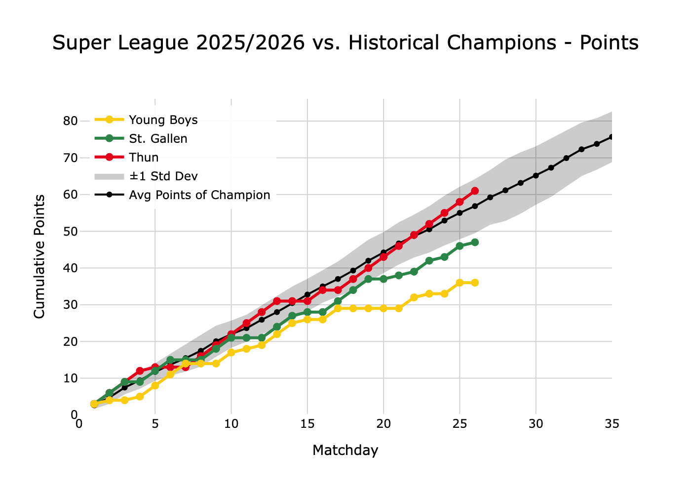
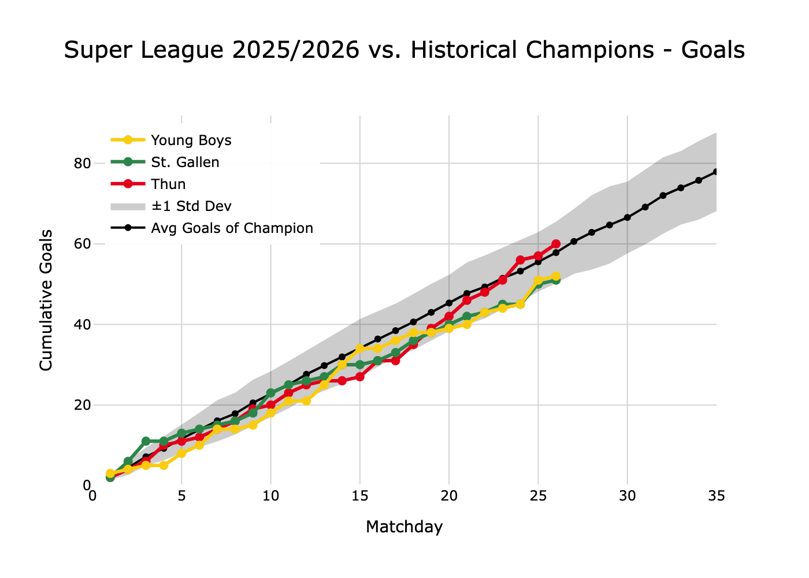
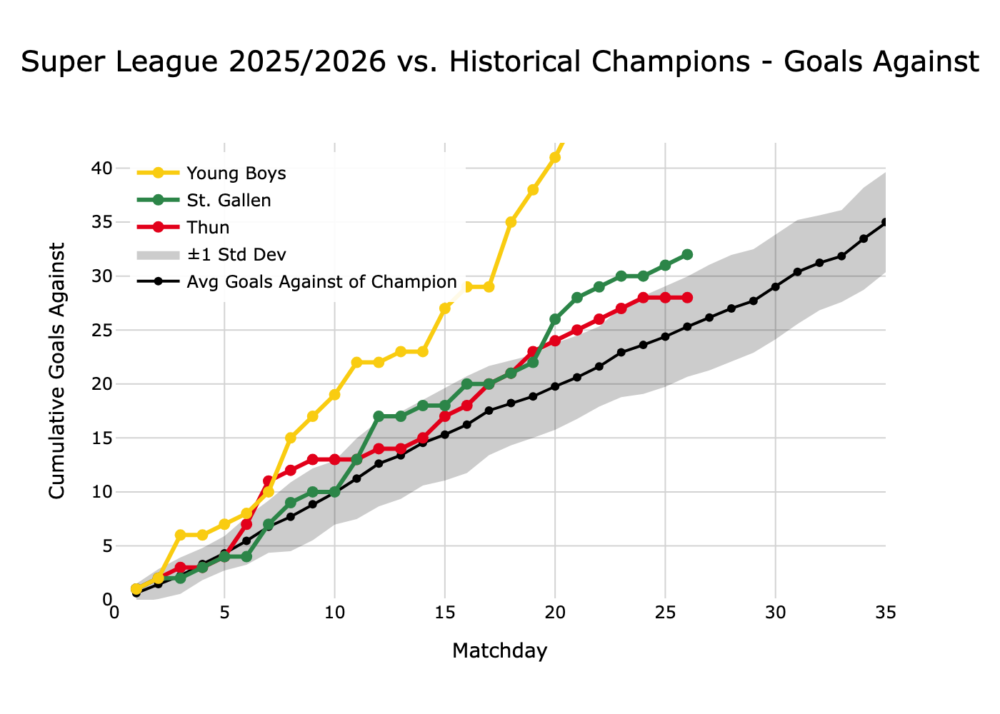

# Swiss Super League Champion Analysis
This analysis compares the historical performance trajectories of Super League champions (2012/13–2024/25) against the 
top contenders of the 2025/26 season.

Using Polars in a Jupyter notebook, we track:

- Cumulative points
- Cumulative goals scored
- Cumulative goals conceded

Key visualizations show whether current leaders are outperforming, matching, or underperforming the average champion 
benchmark (with ±1 std dev bands) at each matchday.

_Data source: https://www.football-data.co.uk/switzerland.php_

### Example

